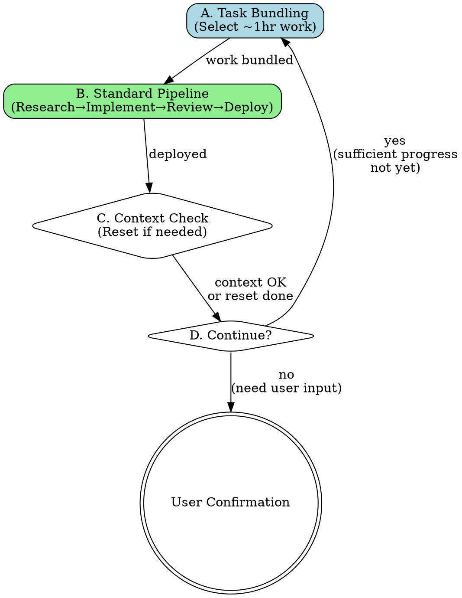
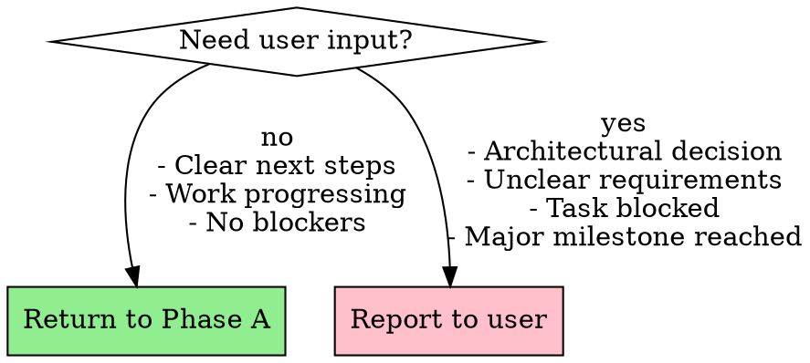

# Autonomous Work Execution

## Overview

**do-work automates the complete development workflow from task selection to deployment, looping autonomously until user input is required.**

Core principle: Bundle 1-hour work chunks → Execute with full quality pipeline → Reset context if needed → Repeat.

## When to Use

Use when:
- Starting a work session on bd-tracked tasks
- Ready for autonomous multi-hour execution
- Working across p9 and agi project directories
- User wants minimal interruption until confirmation needed

Do NOT use when:
- User asked a single specific question
- Task requires immediate user decision
- Exploring/researching without implementation

## Workflow Phases



### A. Task Bundling (~15min)

**Goal**: Select and prepare ~1 hour of focused work.

```markdown
1. **Survey both projects**
   ```bash
   cd ~/2lab.ai/cco4-persona/p9 && bd ready
   cd ~/2lab.ai/cco4-persona/agi && bd ready
   ```

2. **Prioritize top 3**
   - Analyze urgency, dependencies, impact
   - Update priorities: `bd update <id> --priority P0/P1/P2`

3. **Deep investigation**
   - Read actual code related to each task
   - Update task descriptions with findings
   - `bd update <id> --description "Detailed findings..."`

4. **Select primary task**
   - Choose most critical
   - Explain to user: "I will work on [task] because [detailed reasoning]"
   - Mark in-progress: `bd update <id> --status in_progress`

5. **Validate work bundle (~1hr)**
   - If < 1hr: Loop back to step 1, add related/next task
   - If ~1hr: Proceed to Phase B
```

**Decision point**: Keep bundling until reaching ~1hr estimated work.

### B. Standard Pipeline (~45-90min per bundle)

**Goal**: Complete the bundled work with full quality checks.

```markdown
1. **Parallel Research** (5-10min)
   Launch simultaneously:
   - Oracle agent: `Task(subagent_type="oh-my-claude:oracle", prompt="Architecture strategy for [task]")`
   - Explore agent: `Task(subagent_type="oh-my-claude:explore", prompt="Find related code for [task]")`

2. **Implementation** (30-60min)
   - Launch opus45 subagent for execution
   - OR implement directly if straightforward

3. **Code Review Round 1** (5min)
   - Self-review code changes
   - Identify obvious issues

4. **Code Review Round 2** (10min)
   - Oracle (gpt5.2 xhigh): `Task(subagent_type="oh-my-claude:oracle", prompt="Review this implementation for [criteria]")`
   - Address feedback

5. **PR Review Skill** (10min)
   - `Skill(skill="pr-review-toolkit:review-pr")`
   - Resolve all findings

6. **Code Simplification** (5-10min)
   - `Task(subagent_type="code-simplifier:code-simplifier")`
   - Apply simplifications

7. **Quality Gates** (5min)
   ```bash
   bun test        # or npm test / pytest
   bun run build   # if applicable
   bun run lint
   bun run fmt     # or prettier
   ```

8. **Deploy & Review Gate** (2min)
   - Commit with detailed message
   - Push to remote
   - Mark review: `bd set-state <id> phase=review --reason "구현 요약"`
   - **Do NOT `bd close` yet** — wait for review pass

9. **Review Pass → Close with Evidence**
   - Collect evidence from steps 3-7:
     - Test results (pass count, new failures)
     - Build status (tsc clean / errors)
     - Code review agent feedback (addressed / outstanding)
     - Change scope (files count, lines added/removed)
   - Close with evidence:
     ```bash
     bd close <id> --reason "tsc clean, vitest 423 passed (0 new), Oracle reviewed, 5 files +491 lines"
     ```
   - **NEVER** close with vague reasons like "done" or "구현 완료"
```

**Critical**: Do NOT skip steps under time pressure.
**Critical**: NEVER `bd close` without going through `phase=review` first.
**Critical**: NEVER `bd close` without concrete evidence in `--reason`.

### C. Context Management (~2min)

**Goal**: Prevent context overflow breaking the session.

```markdown
Check current context usage (look for warnings)

IF context > 70%:
  1. Save critical state to files
  2. Use `/compact` or similar context compression
  3. OR end session gracefully and document resume point

ELSE:
  Continue to Phase D
```

### D. Loop Decision (~1min)

**Goal**: Decide if autonomous work can continue.



**Stop and ask user if:**
- Architectural decision needed (multiple valid approaches)
- Requirements unclear or ambiguous
- Task is blocked (waiting for external input)
- Major milestone reached (user should review)
- Work session feels "complete enough"

**Continue autonomously if:**
- Next task is clear from bd ready
- All requirements understood
- No blockers
- Haven't reached natural stopping point

## Integration with Other Skills

**REQUIRED during Phase B:**
- `oh-my-claude:oracle` - Architecture decisions
- `oh-my-claude:explore` - Code investigation
- `pr-review-toolkit:review-pr` - Quality gate
- `code-simplifier:code-simplifier` - Code cleanup

**RECOMMENDED:**
- `superpowers:verification-before-completion` - Before claiming done
- `superpowers:systematic-debugging` - If issues found

## Working Directory Awareness

```bash
# Always check BOTH project directories
~/2lab.ai/cco4-persona/p9/     # bd for p9 issues
~/2lab.ai/cco4-persona/agi/    # bd for agi issues
```

Use `bd ready` in each directory, prioritize across both.

## Common Mistakes

| Mistake | Fix |
|---------|-----|
| Bundling < 30min work | Loop back to Phase A, add related tasks |
| Skipping code review steps | All review steps are mandatory |
| `bd close` without `phase=review` | Always `bd set-state <id> phase=review` first, then close after review |
| Continuing when blocked | Stop at Phase D, ask user |
| Forgetting context check | Check every cycle, compress proactively |
| Single-project focus | MUST check both p9 and agi |

## Red Flags - STOP Immediately

These thoughts mean you're about to violate workflow:

- "Code review seems overkill for this small change"
- "I'll skip tests, it's obvious this works"
- "User probably doesn't need to know about this decision"
- "Let me just quickly fix this without the pipeline"
- "Phase A is taking too long, let me just start coding"
- "I'll just bd close, the code looks fine"
- "bd close --reason 'done'" (vague = violation)

**All of these mean: Follow the workflow. No shortcuts.**

## Quality Expectations

**Phase A output:**
- Clear explanation of selected work to user
- Updated bd issue descriptions
- Realistic 1hr estimate

**Phase B output:**
- All tests passing
- All quality gates passed (lint, fmt, build)
- Code reviewed by Oracle
- PR review completed
- Simplified and clean
- Committed and pushed
- `bd set-state <id> phase=review` (then `bd close` after review pass)

**Phase D decision:**
- Explicit reasoning documented
- If stopping: clear resume point for next session

## Session Context

This workflow runs in YOUR current context (not subagent).

- You maintain conversation history with user
- You see cumulative progress
- You manage context limits
- You decide when to loop vs stop

**Context budget**: Aim for 3-4 Phase A→B→C→D cycles per session before needing reset.

## Real-World Impact

**Without do-work:**
- 30min+ per task on workflow overhead
- Inconsistent quality (skip steps under time pressure)
- Frequent context switches lose momentum
- User interrupts break flow

**With do-work:**
- 3-5 hours continuous autonomous work
- Consistent quality pipeline every task
- Natural stopping points for user input
- Momentum maintained across tasks

**Measured benefit**: ~40% time savings from batching overhead, 90% quality consistency.
