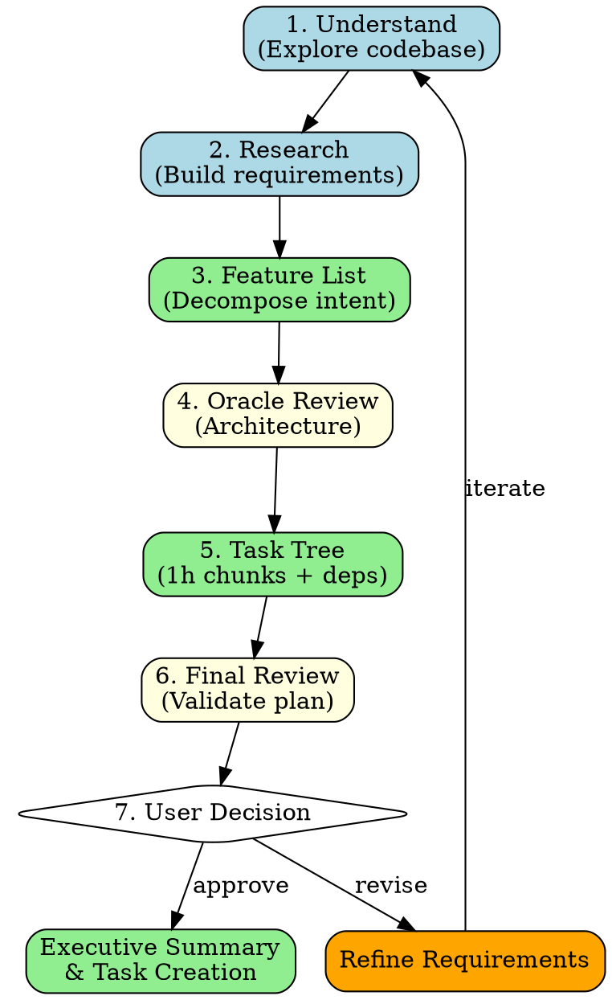

# New Task Decomposition

## Overview

**new-task transforms vague user requirements into structured bd task trees with dependencies, estimated effort, and architectural decisions resolved upfront.**

Core principle: Understand intent deeply → Build comprehensive plan → Get architectural decisions → Create task tree → Confirm before execution.

## When to Use

Use when:
- User describes feature/idea in vague or high-level terms
- Need to decompose work into bd-trackable tasks
- Architectural decisions required before implementation
- Multiple implementation approaches possible
- Work estimate >2 hours (needs task breakdown)

Do NOT use when:
- User request is already specific (1-2 file changes)
- Fixing obvious bug with clear solution
- Task already exists in bd (use existing workflow)
- Quick clarification or simple question

## Workflow Phases



## Phase Details

### Phase 1: Understand Codebase (~10min)

**Goal**: Ground the request in actual project structure.

```markdown
1. **Identify relevant directories/files**
   - Use Explore agent: `Task(subagent_type="oh-my-claude:explore", prompt="Find code related to [user's topic]")`
   - Grep for keywords from user request
   - Check existing similar features

2. **Understand current architecture**
   - Read key files (main entry points, config, types)
   - Identify patterns used (DDD, MVC, etc.)
   - Note tech stack, dependencies

3. **Document findings**
   - Existing related features
   - Current architecture patterns
   - Potential integration points
```

### Phase 2: Research & Build Requirements (~15min)

**Goal**: Transform vague request into specific, implementable requirements.

```markdown
1. **Clarify user intent**
   - What problem does this solve?
   - Who is the user? (dev, end-user, admin)
   - Success criteria?

2. **Research best practices**
   - WebSearch for similar features (if unfamiliar)
   - Context7 for library-specific patterns
   - Check official docs for recommended approaches

3. **Build detailed requirements**
   - Functional requirements (what it does)
   - Non-functional (performance, UX, security)
   - Edge cases, error handling
   - Integration with existing features
```

### Phase 3: Feature List Decomposition (~10min)

**Goal**: Break intent into concrete, implementable features.

```markdown
Create bulleted list of all features needed:

**Example** (for "add authentication"):
- User registration flow
- Login/logout endpoints
- Session management
- Password hashing
- Token generation/validation
- Protected route middleware
- User profile CRUD
- Password reset flow
- Rate limiting for auth endpoints

Group related features, note dependencies
```

### Phase 4: Oracle Architecture Review (~10min)

**Goal**: Get expert review on architectural approach.

```markdown
Launch Oracle with context:

Task(subagent_type="oh-my-claude:oracle", prompt="""
Review this feature plan for architectural soundness:

User Request: [original request]
Feature List: [from Phase 3]
Current Architecture: [from Phase 1]

Questions:
1. Is this approach sound for the existing codebase?
2. What design patterns should be used?
3. What are critical architectural decisions?
4. What could go wrong?
5. Alternative approaches?
""")

Document Oracle's feedback, update feature list if needed.
```

### Phase 5: Task Tree Creation (~20min)

**Goal**: Convert features into 1-hour bd tasks with dependencies.

```markdown
**Task Breakdown Rules:**
- Each task = ~1 hour effort
- If >1 hour: split into subtasks
- If <30min: combine with related task

**For each feature:**
1. Estimate total effort
2. Split into ~1h chunks
3. Identify dependencies (blocks/blocked-by)
4. Assign priority (P0/P1/P2)

**Task Format:**
```
[ID] Task Title [Priority] [Estimate]
Description: What needs to be done
Dependencies: [ID1], [ID2] (if any)
Acceptance Criteria: How to verify complete
```

**Example Tree:**
```
auth-1: Setup authentication schema [P0] [1h]
  ↓ blocks
auth-2: Implement password hashing [P0] [1h]
  ↓ blocks
auth-3: Create register endpoint [P0] [1.5h]
auth-4: Create login endpoint [P0] [1h]
  ↓ blocks
auth-5: Add session middleware [P1] [1h]
  ↓ blocks
auth-6: Protect existing routes [P1] [2h]
```
```

### Phase 6: Final Review (~5min)

**Goal**: Validate the entire plan before presenting to user.

```markdown
Self-review checklist:
- [ ] All features from Phase 3 covered?
- [ ] Task estimates realistic (1h ±30min)?
- [ ] Dependencies correctly identified?
- [ ] Priorities make sense (P0 = critical path)?
- [ ] Acceptance criteria clear?
- [ ] No orphan tasks (all connected)?

Oracle review (optional if major changes):
Task(subagent_type="oh-my-claude:oracle", prompt="Validate this task tree for completeness and dependencies: [task tree]")
```

### Phase 7: User Decision (~5-10min)

**Goal**: Get architectural decisions and final approval.

```markdown
**Present to User:**

"## Feature Plan: [Title]

### Overview
[2-3 sentence summary of what will be built]

### Features
[Bulleted list from Phase 3]

### Task Breakdown
[Show task tree with estimates and dependencies]
Total Effort: [X hours]

### Architectural Decisions Required

[ONLY list decisions that require >1h to change]

**Example:**
1. **Authentication Method** (2h to change)
   - Option A: JWT tokens (stateless, scales better)
   - Option B: Session cookies (simpler, server-side state)
   - Recommendation: [A/B with reasoning]

2. **Storage** (3h to change)
   - Option A: PostgreSQL (relational, ACID)
   - Option B: MongoDB (flexible schema)
   - Recommendation: [A/B with reasoning]

[DO NOT ask about:]
- Naming conventions (easy to change)
- File structure (refactorable)
- UI styling (cosmetic)
- Error message text (trivial)

### Next Steps
Reply:
- 'Approve' to create tasks and start
- 'Change X to Y' to revise decisions
- 'Add/Remove Z' to adjust scope
"

**Handle Response:**
- "Approve" → Phase 8 (Executive Summary)
- Revisions → Update plan, return to Phase 7
- Scope changes → Return to Phase 3
```

### Phase 8: Executive Summary & Task Creation (~10min)

**Goal**: Finalize plan and create bd tasks.

```markdown
1. **Create bd tasks**
   ```bash
   cd [project-dir]

   # Create tasks with dependencies
   bd create --title "[Task]" --type task --priority P0 \
     --description "[detailed description]" \
     --depends-on [parent-task-id]
   ```

2. **Generate Executive Summary**

   "## Executive Summary: [Feature Name]

   ### Scope
   - [X] tasks created
   - [Y] hours estimated effort
   - [Z] critical path items (P0)

   ### Architecture Confirmed
   - [Decision 1]: [Choice made]
   - [Decision 2]: [Choice made]

   ### Task Tree
   [Visual dependency tree]

   ### Critical Path
   [P0 tasks in execution order]

   ### Ready to Execute
   Use `do-work` to begin implementation, starting with:
   [First task ID and title]
   "

3. **Ready for execution**
   - All tasks in bd
   - Dependencies set
   - User can start `do-work` immediately
```

## Integration with Other Skills

**REQUIRED:**
- `oh-my-claude:oracle` - Architecture review (Phase 4, 6)
- `oh-my-claude:explore` - Codebase understanding (Phase 1)

**RECOMMENDED:**
- `oh-my-claude:librarian` - External docs research (Phase 2)
- `superpowers:brainstorming` - If user request very vague

**SEQUENTIAL:**
After new-task completes → Use `do-work` for execution

## Decision Guidelines

### What to Ask User (>1h to change)

| Category | Ask? | Example |
|----------|------|---------|
| Data model | ✅ Yes | SQL vs NoSQL, schema design |
| Architecture pattern | ✅ Yes | Microservices vs monolith, event-driven |
| Major dependencies | ✅ Yes | Choose between libraries A vs B |
| Security approach | ✅ Yes | OAuth provider, encryption method |
| Deployment model | ✅ Yes | Serverless vs VPS, CDN strategy |

### What NOT to Ask (<1h to change)

| Category | Don't Ask | Why |
|----------|-----------|-----|
| Naming | Variable/function names | Refactorable in minutes |
| File structure | Where to put files | Easy to reorganize |
| UI styling | Colors, spacing | Cosmetic, quick to change |
| Error messages | Exact wording | Trivial updates |
| Config values | Timeout, limits | Environment variables |

**Rule of Thumb**: If changing it later requires <1 hour, make a reasonable choice and proceed.

## Common Mistakes

| Mistake | Fix |
|---------|-----|
| Skipping Phase 1 | Always explore codebase first - grounds plan in reality |
| Tasks >2 hours | Split further - easier to track and estimate |
| Missing dependencies | Review task tree for orphans and cycles |
| Asking trivial questions | Only ask >1h decisions |
| No acceptance criteria | Every task needs "how to verify done" |
| Creating tasks immediately | Complete all phases first, then create |

## Red Flags - STOP

These thoughts mean you're skipping steps:

- "Let me just create a few tasks quickly"
- "I know what they want, don't need Phase 2"
- "Oracle review seems overkill"
- "This is too simple for a task tree"
- "Let me ask user about file naming"

**All of these mean: Follow the workflow. All phases.**

## Quality Expectations

**Phase 1 output:**
- 3-5 key files identified
- Current architecture pattern documented
- Integration points noted

**Phase 3 output:**
- 5-15 features listed (if <5, may be too simple; if >15, split into epics)
- Features grouped by domain
- Dependencies between features noted

**Phase 5 output:**
- All tasks ~1h ±30min
- Clear dependency tree (no cycles)
- Priorities assigned (P0 = critical path)
- Acceptance criteria for each

**Phase 7 output:**
- 2-5 architectural decisions presented
- Recommendation for each with reasoning
- Trade-offs explicitly stated

**Phase 8 output:**
- All bd tasks created with dependencies
- Executive summary <300 words
- User knows exactly what to do next

## Real-World Impact

**Without new-task:**
- 30min+ clarifying vague requests
- Missed dependencies discovered mid-implementation
- Rework due to wrong architectural choices
- Unclear scope, effort estimates

**With new-task:**
- 60-90min upfront planning
- Clear task tree with dependencies
- Architectural decisions made before coding
- Accurate effort estimates
- User confidence in plan

**Measured benefit**: ~3x reduction in mid-implementation surprises, 2x better effort estimates.
