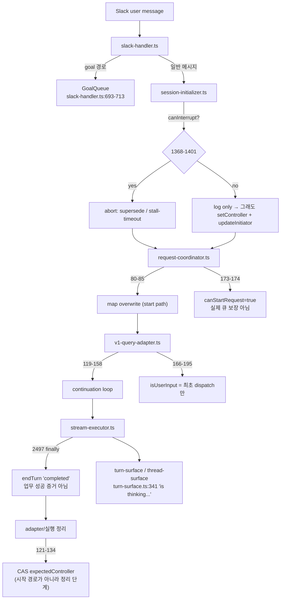
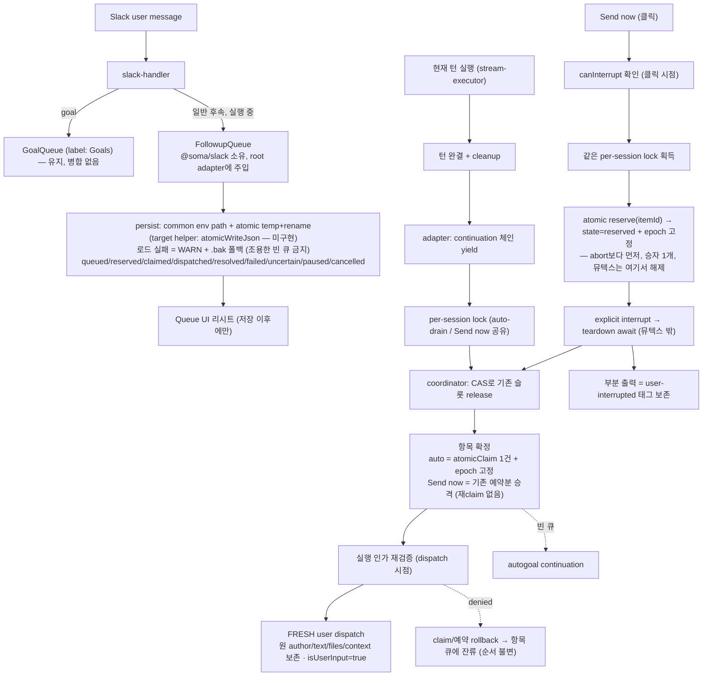
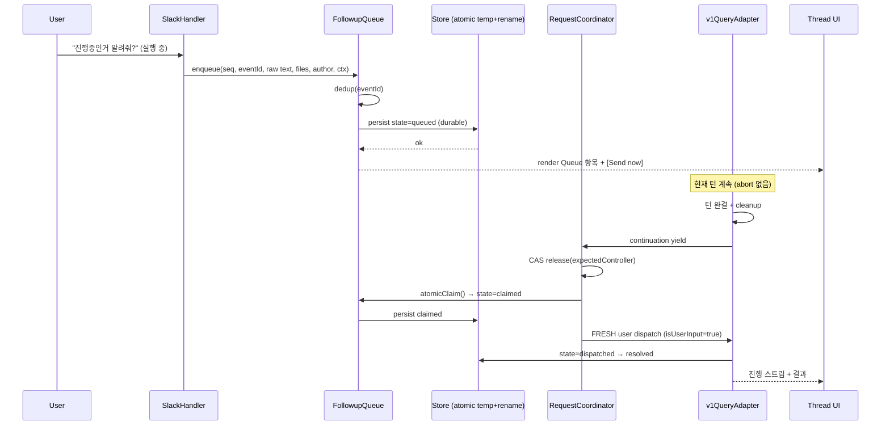
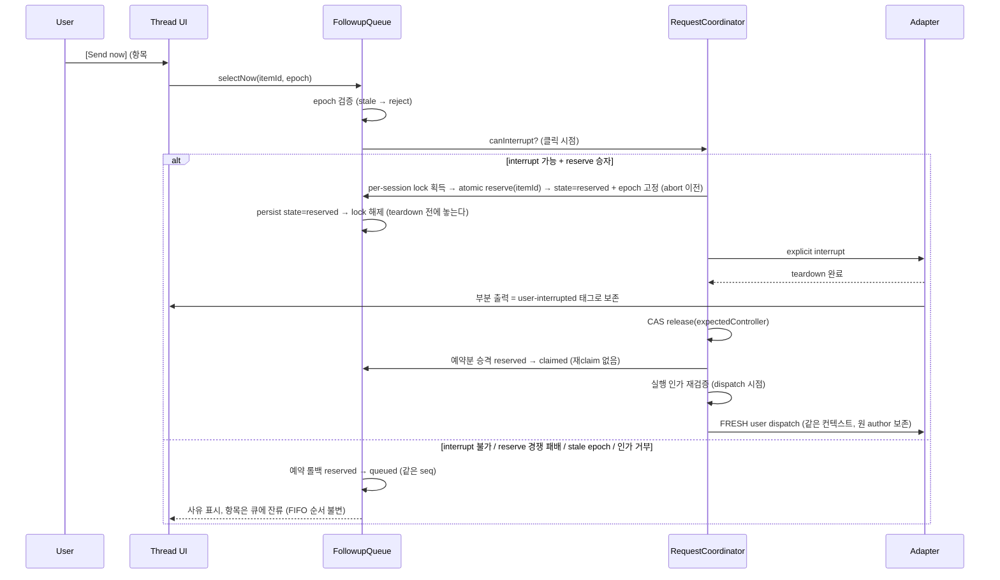
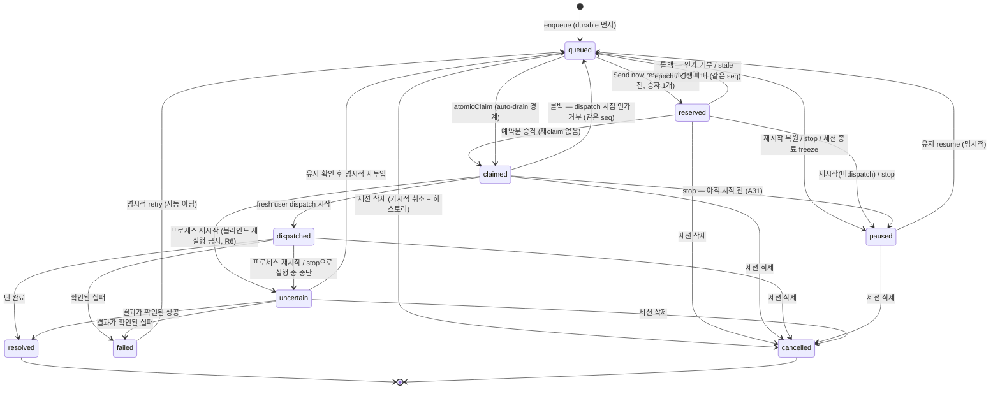

# 05 — Slack Agent UI + Followup Queue (Architecture)

Status: planned (구현 미착수)
Date: 2026-09-14
Spec: [`.prd/04-slack-agent-ui-spec.md`](04-slack-agent-ui-spec.md) · SSOT: [`.prd/slack-agent-ui/ssot.md`](slack-agent-ui/ssot.md)

모든 `file:line`은 SHA `7546179677e4dfb671a55f077b0b578693f064e4` 기준 검증본이다
(`deploy.yml`·`rules/config.md` 좌표는 본 개정에서 재확인). 상태 기계의 되돌릴 수 있는 결정 = SSOT §8.

## 1. 현재 구조 (as-is)

**결함 축**: 후속 메시지를 담을 durable 큐가 없다. `canStartRequest`는 "시작 가능"만 말하고
보관을 약속하지 않으며, supersede 경로는 진행 중 실행을 끊는다. `isUserInput`이 최초 dispatch에만
붙어 continuation 안에서 재현할 수 없다.

## 2. 목표 구조 (to-be)

우선순위 규칙: **followup → (빈 큐일 때만) autogoal.** 두 큐 사이에 암묵적 cross-level FIFO를 만들지 않는다.

직렬화 규칙: auto-drain과 `Send now`는 **같은 per-session lock**을 공유하고, 두 경로 모두 동일한 꼬리를
탄다 — **CAS release → 항목 확정 → 인가 재검증 → fresh dispatch.** `Send now`는 **abort 이전에**
항목을 atomic reserve 해 **`reserved` 상태**로 바꾸고 epoch을 고정하므로 더블클릭·drain 경합에서
승자 1개만 abort를 일으키며(두 번 abort 불가), 뒤에서 **다시 claim 하지 않고 예약분을 승격**한다
(`reserved → claimed`, 이중 claim 없음).
인가 거부·stale epoch이면 예약/claim을 롤백해 **같은 seq로 `queued` 복귀**시킨다(FIFO 순서 불변, seq 재발급 없음).

**교착 방지**: 잠금은 **짧은 상태 뮤텍스** 하나뿐 — reserve/claim/승격 같은 큐 상태 전이만 감싸고 예약 직후 즉시 해제한다.
interrupt·teardown·CAS release·Slack 네트워크 호출은 뮤텍스 **밖**에서 돈다. 이후 상호배제는 **dispatch 예약 + epoch**이 맡는다:
예약이 살아 있는 동안 auto-drain과 teardown 중 도착한 **새 idle 입력**은 예약자 뒤로 밀리고, 슬롯 release 직전 틈으로
다른 user dispatch가 끼어들 수 없다. 낡은 epoch 요청은 뮤텍스 없이 거절되므로 정리 경로가 블로킹되지 않는다.

**작성자 동일성**: 큐 항목은 다른 작성자의 메시지일 수 있다. dispatch는 항상 **원 메시지 author**로
실행되며, `Send now`를 누른 사람이 작성자를 대체하지 않는다. 버튼 클릭자는 인가 주체일 뿐이고,
text/files/context와 author identity는 enqueue 시점 값을 유지한다.

## 3. 시퀀스 — 일반 enqueue → drain

## 4. 시퀀스 — Send now

## 5. 항목 상태 기계

terminal = `resolved` / `cancelled`. 세션 삭제는 **terminal이 아닌 모든 상태**에서 `cancelled`로 가며
히스토리를 남긴다(A18). `reserved → uncertain` 전이는 **일부러 없다** — 예약만 된 항목은 실행되지 않았으므로
재시작·stop에서 `paused`로 간다(SSOT §8 R3). 반대로 `claimed`/`dispatched`의 크래시 결과는 `uncertain`으로
남긴다(부작용 여부 불명, R6).

## 6. 배치와 경계

| 관심사 | 위치 | 근거 |
|---|---|---|
| 큐 도메인 + 상태기계 | `packages/slack` (`@soma/slack`) | `rules/packaging.md` 경계, 루트에 이중 출처 만들지 않음 |
| 주입 지점 | root adapter (DI) | CLAUDE.md Design Decision 8 |
| 영속화 | `@soma/common` env 경로 + **검증된 atomic temp+rename 재사용** (`packages/process-shared/src/mcp-tool-grant-store.ts:121`) | `rules/config.md` 단일 출처 + 원자성. 규칙이 부르는 공용 헬퍼 `atomicWriteJson`은 **저장소에 존재 확인 안 됨**(`rg --type ts` 매치 0) → **target 이름**, 없으면 신설 |
| 로드 실패 처리 | 같은 store: WARN 로그 + `.bak` 폴백, 실패 시 degraded 표시 | `rules/config.md:11`, `:37` — "조용히 빈값"은 데이터 전손 |
| capacity 설정 | 설정 모듈의 타입드 getter `SOMA_FOLLOWUP_QUEUE_CAPACITY`(기본 100) | `rules/config.md:8`(타입드 getter 1회), `:12`(`SOMA_` 프리픽스). 도메인에서 `process.env` 직접 읽기 금지 |
| 슬롯 해제 CAS | `packages/slack/src/request-coordinator.ts:121-134` 재사용 | 기존 CAS 의미론 유지(정리 단계) |
| drain 트리거 | adapter continuation 경계(`src/agent-session/v1-query-adapter.ts:119-158`) | `packages/slack/src/pipeline/stream-executor.ts:2497`의 `finally endTurn('completed')`는 성공 증거가 아니므로 트리거로 부적합 |
| `isUserInput` 재부여 | `src/agent-session/v1-query-adapter.ts:166-195` 확장 | 현재는 최초 dispatch만 |

## 7. UI 계층

- 헤더: 단계 + **실제 마지막 활동**(heartbeat와 분리; `packages/slack/src/turn-surface.ts:341`의 리터럴
  `is thinking...`은 진행 증거가 아님) + `Queue`.
- 본문: 단일 진행 스트림(task/plan/tool) → 결과 → 피드백. 중복 완료 카드·MCP 성공 스팸 제거.
- 승인: 일반 액션과 분리된 컨트롤 경로, stop은 명시적.
- rendered-empty 가드는 중앙 1곳. 첨부-only 메시지는 허용하되 접근성 fallback 필수.
- legacy fallback에서도 Queue/Send now 유지.

## 8. 신뢰성

- 스레드 post/update는 outbox를 통해 rate limit을 지키고, 재시작 후 idempotent(중복 카드 금지).
- `packages/slack/src/stream-processor.ts:348` idle 기본 2h — 침묵 기반 하드 abort를 추가하지 않는다.
- `packages/slack/src/mcp-status-tracker.ts:176` cleanup이 in-memory이므로 재시작 후 MCP 상태를 완료로 단정하지 않는다.
- 호스트 크래시 복구는 orphan active를 `uncertain`으로 두고 사람이 판단하게 한다.

## 9. 배포 토폴로지 (현재 임무 — 프리뷰 채널 한정)

`.github/workflows/deploy.yml:40-71`의 "Resolve deploy targets"는 `:49`에서 채널에 따라
`PRODUCTION_DEPLOY_TARGETS`(`deploy/prod`) 또는 `PREVIEW_DEPLOY_TARGETS`(그 외)를 고른 뒤,
`:53-71`에서 그 변수의 **모든 줄**(`{runner-label}:{target-dir}`)을 matrix로 확장한다. **제외 필터가 없다.**
`:117-127`의 deploy job이 `matrix.runner_label`을 self-hosted 라벨로 그대로 쓴다.

따라서 **"work-m64 제외"는 현재 미구현이며 구현됐다고 적지 않는다.** 성립 절차:
두 변수를 **읽기 전용**으로 열거 → runner label과 실제 host alias를 대조해 work-m64의 canonical 이름·alias 확정 →
**프리뷰 한정** per-run allowlist 확정. 그 메커니즘이 워크플로 파일이나 repo variable 변경을 요구하면
**별도 리뷰·승인** 대상이다(다른 배포 채널에 영향). 미상 target이 남으면 **fail closed** —
무필터 `main:deploy/dev` push 금지, prod 채널은 이 임무 밖(유저 게이트).
repo 내 `work-m64` 문자열 매치는 0(`.prd` 제외)이므로 alias는 in-repo 증거로 해결할 수 없다.

## 10. 미검증 / 채택 보류

- bolt 5.1 / web-api 8.1 미설치 (현재 `package.json:53-54` = bolt 4.7.0, web-api ^7.15.1).
  다만 **task card / plan block 타입은 설치본에 이미 있다**(`@slack/types@2.20.1`:
  `dist/chunk.d.ts:22,:30`, `dist/block-kit/blocks.d.ts:21,:305,:339`,
  `@slack/web-api/dist/types/request/chat.d.ts:198`) → 업그레이드는 **Agent Sessions lifecycle**
  (`web-api/dist/methods.d.ts`에 `agents` 매치 0)을 채택할 때만 게이트다. 상세 = 04 §4.3.
- **타입 존재는 렌더 증거가 아니다** — task/plan·streaming의 live 채택은 전부 **NOT TESTED**(A35).
- SDK task status enum, `assistant_view` 호환성 미검증.
- `agent_view`는 비가역 — 별도 승인 대상, 본 설계에 포함하지 않음.
