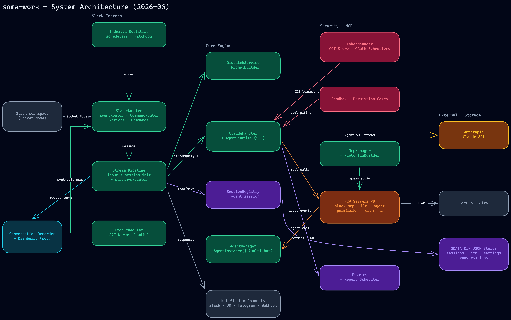

# Architecture Overview

soma-work (Slack multi-tenant AI Assistant) 아키텍처 문서. 2026-06-10 기준 전면 재작성.

> 편집 가능한 다이어그램 원본: [`architecture-diagram.excalidraw`](./architecture-diagram.excalidraw) (excalidraw.com에서 열기)



## Process Model

단일 Node 프로세스(`src/index.ts`, ~1,100 LOC)가 Slack Bolt(Socket Mode)로 기동하며, 부트스트랩 시 다음 백그라운드 컴포넌트를 와이어링한다:

| 컴포넌트 | 역할 | 위치 |
|----------|------|------|
| TokenManager + CCT Store | Claude OAuth 토큰 슬롯 풀, 자동 회전 | `src/token-manager.ts`(2.1k), `src/cct-store/` |
| OAuth/Usage Schedulers | 토큰 갱신·사용량 폴링 | `src/oauth/` |
| GitHub Auth | App installation 토큰 자동 갱신 | `src/github-auth.ts`, `src/github/` |
| McpManager | MCP 서버 프로비저닝 (stdio) | `src/mcp-manager.ts`, `src/mcp/` |
| PluginManager | 플러그인/마켓플레이스 라이프사이클 | `src/plugin/` |
| AgentManager | 멀티 에이전트 인스턴스 기동 | `src/agent-manager.ts`, `src/agent-instance.ts` |
| A2T Service | 음성→텍스트 (Python worker) | `services/a2t/worker.py` |
| CronScheduler | 예약 synthetic 메시지 트리거 | `src/cron-scheduler.ts` |
| Conversation Recorder | 대화 기록 + 리플레이 웹 대시보드 | `src/conversation/` |
| Metrics Schedulers | 토큰/비용 텔레메트리 집계·리포트 | `src/metrics/` |
| Socket Watchdog | Socket Mode 헬스 모니터 | `src/slack-socket-watchdog.ts` |

## Core Request Flow

```
Slack Event (Socket Mode)
  → SlackHandler (src/slack-handler.ts, 1.5k)
      EventRouter · CommandRouter · Actions(9) · Commands(20+)
  → Stream Pipeline (src/slack/pipeline/)
      input-processor → session-initializer → stream-executor
      ├ SessionRegistry.getOrCreate (src/session-registry.ts, 2.2k)
      ├ DispatchService 워크플로우 분류 + PromptBuilder 프롬프트 조립
      └ McpConfigBuilder 툴 목록 구성
  → ClaudeHandler + AgentRuntime (src/claude-handler.ts, src/agent-runtime/)
      ├ TokenManager: CCT lease + query env 주입 (src/auth/)
      ├ Sandbox·Permission 게이트 (src/sandbox/, somalib/permission/)
      └ Claude Agent SDK streaming
  → 스트림 이벤트 처리 (text / tool_use / tool_result)
      ├ MCP 툴 호출 → packages/mcp-servers/*
      ├ Metrics 이벤트 적재
      └ Conversation Recorder 기록
  → NotificationChannels (src/notification-channels/)
      Slack · DM · Telegram · Webhook 출력 라우팅
```

## Major Subsystems

### Multi-Agent (`src/agent-manager.ts`, `src/agent-instance.ts`, `src/agent-runtime/`, `src/agent-session/`)
- `AgentManager`가 config의 agent 항목마다 `AgentInstance` 소유
- 각 인스턴스는 격리된 Bolt App(별도 봇 토큰), SessionRegistry, PromptBuilder 보유
- 메인 에이전트의 Claude 턴에서 agent MCP(`packages/mcp-servers/agent/`)의 `agent_chat`으로 라우팅 — 단, 실제 Claude SDK query 통합은 아직 placeholder (agent-mcp-server.ts TODO). 직접 @멘션/DM 처리도 `SlackHandler` 통합 대기 중 (`src/agent-instance.ts` TODO)
- `agent-session/`: turn runner, session phase, continuation handler

### Auth / Token (`src/token-manager.ts`, `src/cct-store/`, `src/oauth/`, `src/auth/`)
- CCT 슬롯 풀: v2 스키마, CAS 기반 atomic slot flip
- OAuthRefreshScheduler가 5시간/7일 임계값으로 자동 회전 + Slack 알림
- 쿼리마다 `ensureActiveSlotAuth()` → lease → env 주입 → release

### MCP (`src/mcp-manager.ts`, `src/mcp-config-builder.ts`, `packages/mcp-servers/`)
- 8개 내장 서버: slack-mcp, llm, agent, model-command, server-tools, permission, cron, mcp-tool-permission
- 외부 MCP는 config.json 기반 프로비저닝, GitHub 인증 주입

### Security (`src/sandbox/`, `somalib/permission/`, `src/dangerous-command-filter.ts`)
- 도메인 allowlist, 툴 권한 레벨(admin/elevated/user), dangerous command 감지
- 권한 승인 UI는 Slack 액션으로 처리 (`src/slack/actions/permission-action-handler.ts`)

### Observability (`src/metrics/`, `src/conversation/`)
- 이벤트 기반 텔레메트리(토큰·툴콜·레이턴시), 주기 리포트
- 대화 레코더 + 웹 대시보드(`src/conversation/dashboard.ts`)

## Data Stores (`$DATA_DIR`, JSON 파일 기반)

| Store | 내용 |
|-------|------|
| `sessions.json` | 세션 상태·goal·instruction (SessionRegistry) |
| `cct-store.json` | OAuth 토큰 슬롯, 사용량 스냅샷 (v2) |
| `user-settings.json` | 유저별 model/effort/verbosity |
| `user-memory/{userId}.json` | 유저 메모리 |
| `user-skills/{userId}/` | 유저 정의 스킬 |
| `conversations/{id}.json` | 턴 단위 대화 기록 |
| `cron-storage.json` | 예약 작업 |
| `session-archive/` | 크래시/복구 세션 스냅샷 |

외부 스토어(선택, MCP 경유): ClickHouse(메트릭), MongoDB, Redis, MySQL.

## Repository Layout

```
src/                  # 메인 앱 (~130k LOC)
packages/
  common/             # 공유 상수·헬퍼
  process-shared/     # MCP 클라이언트, config 캐시
  mcp-servers/        # 내장 MCP 서버 8종
  test-utils/         # 모킹 유틸
somalib/              # soma 계열 공유 라이브러리 (model-commands, permission, cron)
services/a2t/         # 음성 전사 Python worker
infra/                # docker, slack manifest, claude harness 설정
```

## External Integrations

Slack(Bolt 4.x, Socket Mode) · Anthropic Claude Agent SDK · GitHub(App OAuth + REST) · Jira · Telegram(알림 폴백) · Webhook · esm.sh 기반 내부 렌더러 스킬.

## Design Principles

1. **Facade + Pipeline**: SlackHandler/ClaudeHandler가 진입 파사드, 실제 처리는 pipeline 3단계로 분리
2. **격리**: AgentInstance 단위 장애 격리, MCP 서버는 별도 프로세스(stdio)
3. **DI**: CommandRouter 등은 deps 주입으로 테스트 격리
4. **Event-driven**: 스트림 콜백 + 메트릭 이벤트 버스

## History

- 2026-06-10: 전면 재작성 (multi-agent, CCT v2, sandbox, metrics, notification-channels, a2t 반영). 이전 버전은 git history 참조.
