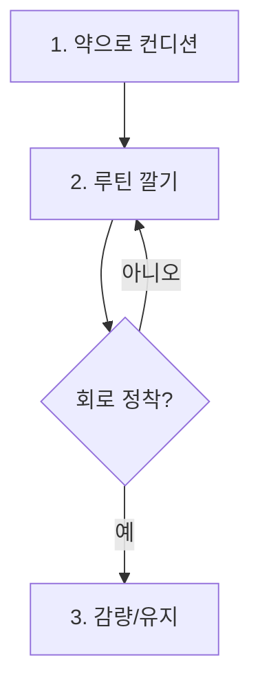
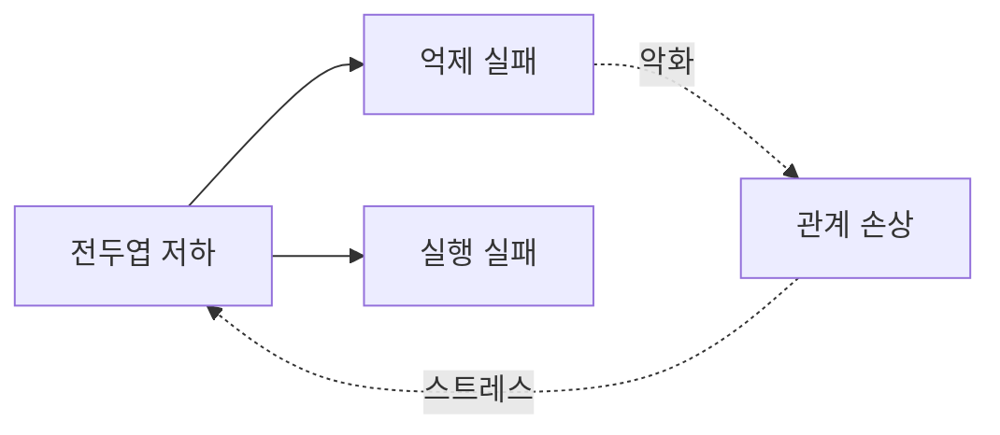

# Renderers — 렌더러 상세

엔진 산출물(중첩 구조)을 받아 형식별로 출력한다. 선택 기준은 SKILL.md의 매트릭스. 여기는 템플릿.

---

## 1. HTML 접이식 트리

문서·블로그·공유용 기본. `<details>/<summary>` 중첩이 트리 구조와 1:1 대응하고, 접기/펼치기 자체가 점진적 공개(progressive disclosure)를 구현한다 — 독자가 인지부하를 스스로 조절한다.

규칙:
- 다크 테마, 모노 계열 폰트 스택. 전체를 래퍼 클래스(`.stx`)로 감싸고 **모든 CSS를 그 클래스에 스코프**하라 — Hugo 등 기존 사이트에 박아도 바깥 스타일을 오염시키지 않게.
- 핵 노드는 `open` 상태로, 위성·세부는 접힌 상태로 시작 — 첫 화면이 곧 요약이 되게.
- 노드 유형은 색이 아니라 기호+색 병행 (◆ ※ ✗ ○) — 색만으로 구분하지 마라.

템플릿 골격:

```html
<div class="stx">
<style>
.stx{--bg:#0a0a0a;--fg:#e5e5e5;--dim:#737373;--line:#262626;--acc:#fbbf24;--ok:#4ade80;--no:#f87171;
  background:var(--bg);color:var(--fg);padding:1.5rem;border-radius:8px;
  font-family:"Geist","Inter","IBM Plex Sans",system-ui,sans-serif;font-size:.925rem;line-height:1.6}
.stx .root{font-family:"JetBrains Mono","IBM Plex Mono",monospace;font-weight:600;margin-bottom:1rem}
.stx details{border-left:1px solid var(--line);margin:.25rem 0 .25rem .5rem;padding-left:1rem}
.stx summary{cursor:pointer;font-weight:500;list-style:none}
.stx summary::before{content:"▸ ";color:var(--dim)}
.stx details[open]>summary::before{content:"▾ "}
.stx .leaf{color:var(--dim);margin:.15rem 0 .15rem 1.5rem}
.stx .t{color:var(--acc)}      /* ◆ 긴장·경계 */
.stx .ok{color:var(--ok)}     /* ○ 정답 */
.stx .no{color:var(--no)}     /* ✗ 실패 */
.stx .legend{margin-top:1.25rem;color:var(--dim);font-size:.8rem;border-top:1px solid var(--line);padding-top:.75rem}
</style>
<p class="root">결론 한 줄 — 지배 구조를 한 문장으로</p>
<details open><summary>[0] 뿌리 — 단일 원인</summary>
  <p class="leaf">원문 증거 단위</p>
  <details><summary><span class="t">◆ 긴장/비대칭 노드</span></summary>
    <p class="leaf"><span class="no">✗ 흔한 오독</span> → <span class="ok">○ 실제 구조</span></p>
  </details>
</details>
<p class="legend">세로축=인과 · ◆=긴장/경계 · ※=오해 차단 · ✗/○=실패/정답</p>
</div>
```

---

## 2. Mermaid

### flowchart — 순서·분기·루프가 있을 때

트리가 표현 못 하는 것: 순환, 합류, 조건 분기. 과정형 대상이 루프백("실패 시 1로")을 가지면 무조건 이쪽.



### graph — 교차 참조·피드백이 본질일 때

여러 부모를 갖는 노드, 상호 인과가 2개 이상이면 계층이 아니라 관계망이다. 인정하고 그래프로.



점선은 피드백/간접 관계, 실선은 직접 인과로 구분하라.

---

## 3. 표 — 비교형 전용

기준 × 선택지 격자가 구조의 본질이면 트리보다 표. 행=판단 기준(핵), 열=선택지, 셀=원문 증거. 마지막 행에 "갈리는 조건"(어떤 상황이면 어느 쪽인지)을 박아라 — 표를 결론 없이 끝내지 마라.

| 기준 | 선택지 A | 선택지 B |
|---|---|---|
| 기준 1 (핵) | 원문 증거 | 원문 증거 |
| **갈리는 조건** | X면 A | Y면 B |

---

## 4. 계층 제목 문서 — 글 자체 재작성

대상이 "재구성된 글"을 원할 때. 트리를 산문으로 펼치되 신호 원리를 적용한다:

- 제목 계층 = 트리 계층 (H2=1단계 가지, H3=2단계).
- 각 섹션 첫 문장 = 그 서브트리의 핵 (preview sentence — 제목과 같은 신호 효과).
- 결론을 문서 최상단에 (피라미드 원칙: 결론 우선).
- 형제 섹션은 같은 종류·같은 문법 구조로 (수평 논리).

---

## 공통 마감 체크

- [ ] 결론 한 줄이 최상단에 있는가
- [ ] 노드/제목이 라벨이 아니라 내용 요약형인가
- [ ] 범례가 있는가 (기호 쓴 경우)
- [ ] 형식이 구조 특성과 일치하는가 (루프 있는데 트리 아닌가)
